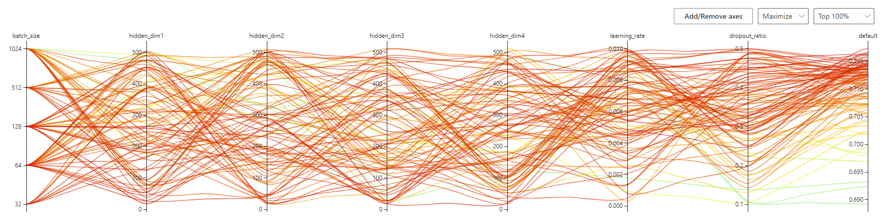

# ReadMe

### **SKN04-2nd-4Team**

# **고객 이탈 예측 모델**

- 프로젝트 기간 : 2024-09-27 ~ 2024-09-30

## **팀원 및 역할**

| 이름 | 역할 |
| --- | --- |
| 신원영 |  총괄, DL, ML, Git 관리 |
| 오정연 |  DL, 전처리 |
| 하상집 |  ML, 전처리 |
| 오종수 | ML, EDA |

**프로젝트 개요**

- 고객의 기본적인 데이터 및 고객의 사용 패턴을 포함한 총 56의 특징들을 바탕으로 고객이 이탈할 가능성을 예측하는 머신러닝 및 딥러닝 기반의 이진 분류 모델을 개발하여, 기업 맞춤 고객 유지 전략을 세울 수 있도록 함

**서비스 목표**

- 다양한 머신러닝 및 딥러닝 모델을 적용해보고, 그 중 가장 좋은 성능을 보이는 고객 이탈 예측 모델을 통해, 이탈 가능성이 높은 고객을 사전에 예측하여, 맞춤형 유지 전략을 제공할 수 있음
- 모델로부터 얻을 수 있는 중요도를 통해 고객 이탈 여부에 영향을 주는 요인을 찾아낼 수 있음

### 데이터 확인 및 분석(EDA)

**1. 고객이탈 비율**


 

**2. 카테고리 변수 이탈율 차이 시각화**

1. 고객 관련 변수
    1. IncomeGroup: 소득 그룹
    2. ChildrenInHH: 가정 내 자녀 수
    3. Occupation: 직업
    4. MaritalStatus: 혼인 상태
        
        
        

1. 서비스 이용 관련 변수
    1. HandsetRefurbished: 리퍼폰 사용 여부
    2. HandsetWebCapable: 웹 기능 탑재 여부
    3. HandsetModels: 핸드셋 모델
        
        
        

1. 사용량 관련 변수
    1. HandsetPrice: 핸드셋 가격
    2. NewCellphoneUser: 신규 휴대폰 사용자 여부
    3. TruckOwner: 트럭 소유 여부
    4. RVOwner: RV 소유 여부
        
        
        
    
2. 마케팅 및 반응 관련 변수
    1. BuysViaMailOrder: 우편 주문 구매 여부
    2. BuysViaMailOrder: 우편 주문 구매 여부
    3. OptOutMailings: 우편 발송 제외 여부
    4. MadeCallToRetentionTeam: 유지팀에 전화한 적 여부
        
        
        
    

**3. 숫자형 변수 이탈율 차이 시각화** 

- Target(Churn)에 따른 수치형으로 변수 분포
    
    .png)
    
- Target(Churn)에 따른 이진 분류된 변수 분포
    
    .png)
    

# Machine Learning

## **사용된 ML모델**

1. Decision Tree
2. Random Forest
3. XGBoost
4. LightGBM
5. CatBoost

## 모델 별 평가 지표

| 모델 | Accuracy | Precision | Recall | F1 Score | ROC AUC |
| --- | --- | --- | --- | --- | --- |
| **Decision Tree** | 0.7121 | 0.0000 | 0.0000 | 0.0000 | 0.6144 |
| **Random Forest** | 0.7197 | 0.6323 | 0.0631 | 0.1148 | 0.6743 |
| **XGBoost** | 0.7222 | 0.5567 | 0.1719 | 0.2627 | 0.6741 |
| **LightGBM** | 0.6476 | 0.4121 | 0.5251 | 0.4617 | 0.6657 |
| **CatBoost** | 0.7240 | 0.5906 | 0.1342 | 0.2187 | 0.6811 |

모델 성능 평가 결과를 통해, CatBoost와 XGBoost가 상대적으로 좋은 성능을 보이고 있습니다. 하지만 모든 모델에서 Recall이 낮은 편이므로, 모델의 클래스 불균형 문제를 해결하기 위한 추가적인 조치가 필요할 수 있습니다.향후 모델 성능을 개선하기 위해 다음과 같은 방법을 고려할 수 있습니다:

- **데이터 불균형 문제 해결**: 오버샘플링, 언더샘플링, 또는 SMOTE와 같은 기법을 사용하여 클래스 불균형 문제를 해결할 수 있습니다.
- **하이퍼파라미터 튜닝**: Grid Search, Random Search 을 통해 모델의 하이퍼파라미터를 조정하여 성능을 개선할 수 있습니다.
- **앙상블 방법**: 여러 모델을 결합하여 예측의 정확성을 높일 수 있습니다.

## Feature Importance Summary for Each Model

### 1. **Decision Tree Model**

- `CurrentEquipmentDays`: 71.82%
- `MonthsInService`: 28.18%
    
    이 모델에서는 `CurrentEquipmentDays`가 가장 중요한 변수로, `MonthsInService`도 중요하게 작용했습니다.
    

### 2. Random Forest Model

_%25EC%25A0%2588%25EC%2582%25AD.png)

- `CurrentEquipmentDays`: 6.33%
- `PercChangeMinutes`: 5.13%
- `MonthsInService`: 4.72%
- `MonthlyMinutes`: 4.65%
- `ServiceArea`: 4.41%
Random Forest 모델에서는 `CurrentEquipmentDays`, `PercChangeMinutes`, `MonthsInService` 등의 변수가 중요한 역할을 했으며, 많은 변수들이 비슷한 중요도를 나타냈습니다.

### 3. XGBoost Model

_%25EC%25A0%2588%25EC%2582%25AD.png)

- `CurrentEquipmentDays`: 5.26%
- `MonthsInService`: 4.39%
- `RetentionCalls`: 3.47%
- `HandsetRefurbished`: 3.33%
- `HandsetWebCapable`: 2.57%
XGBoost 모델에서는 `CurrentEquipmentDays`와 `MonthsInService`가 여전히 중요한 변수로 나타났으며, `RetentionCalls`와 `HandsetRefurbished`도 영향을 미쳤습니다.

### 4. LightGBM Model

_%25EC%25A0%2588%25EC%2582%25AD.png)

- `PercChangeMinutes`: 483
- `MonthlyMinutes`: 432
- `PercChangeRevenues`: 406
- `ServiceArea`: 403
- `CurrentEquipmentDays`: 396
    
    LightGBM 모델에서는 `PercChangeMinutes`와 `MonthlyMinutes`가 중요한 변수로 나타났으며, `CurrentEquipmentDays`도 중요한 역할을 했습니다.
    

### 5. **CatBoost Model**

_%25EC%25A0%2588%25EC%2582%25AD.png)

- `MonthsInService`: 10.32%
- `CurrentEquipmentDays`: 8.01%
- `PercChangeMinutes`: 7.38%
- `MonthlyMinutes`: 7.05%
- `TotalRecurringCharge`: 4.56%
CatBoost 모델에서는 `MonthsInService`가 가장 중요한 변수로 나타났고, `CurrentEquipmentDays`와 `PercChangeMinutes`도 중요한 역할을 했습니다.

### 6. 각 모델 별 변수 중요도 결론

- 각 모델에서 중요한 변수가 다소 다르게 나타났지만, `CurrentEquipmentDays`와 `MonthsInService`는 여러 모델에서 공통적으로 중요한 변수로 나타났습니다.

### 7. 상관 관계 기준 추가 모델링

- 이상치 제거 및 결측치 보완한 데이터 머신 러닝 성능
    
    
    
    - DL 결과
        
        
        
- XGBoost 가 선택한 (4개의 컬럼)만으로 측정한 결과
    
    
    
    - DL 결과
        
        
        
    - R1을 올리기 위하여 y에 가중치
        
        
        
        
        
- LGBM이 선택한 상위 (8컬럼) 의 머신 러닝 결과
    - LGBM이 선택한 상위 (8컬럼)
        - PercChangeMinutes
        - ServiceArea
        - PercChangeRevenues
        - MonthlyMinutes
        - CurrentEquipmentDays
        - MonthlyRevenue
        - OffPeakCallsInOut
        - MonthsInService
    
    
    
    - DL결과
        
        
        
- 상관관계(0.6) 높은 컬럼을 병합(PCA)한 데이터 머신 성능
    
    
    
- 상관관계(0.3) 높은 컬럼을 병합(PCA)한 데이터 머신 성능
    - Logistic Regression의 순위가 바뀌긴 했지만 유의미한 차이는 발생하지 않음
    
    
    
- 상관관계(0.1)  컬럼을 병합(PCA)한 데이터 머신 성능
    
    
    

# Deep Learning

## **사용된 DL**

### **MLP**

- DL 설정
    
    ```bash
    {
        "learning_rate": 0.007551330613219028,
        "dropout_ratio": 0.32776002940655546,
            "hidden_dim1": 54,
            "hidden_dim2": 499,
            "hidden_dim3": 28,
            "hidden_dim4": 388,
        "batch_size": 128,  
        "output_dim": 1,
        "nni": true,
        "seed": 0,  
        "epochs": 100,
        "use_batch_norm": true
    }
    ```
    
- NNI 100회 Trial 결과
    - 튜닝 결과 0.6~0717 까지 정도의 변동이 있었음





# **결론**

- 딥러닝 모델(MLP)은 머신러닝 모델들과 비교했을 때 비슷한 수준의 성능을 보여주었습니다.
- 데이터 전처리 방법(이상치 제거,  결측치 보완,  PCA 등)에 따라 모델의 성능이 조금씩 변화했지만, 전반적인 성능에 큰 영향을 미치지는 않았습니다.
- XGBoost와 LGBM이 선택한 중요 변수들만으로도 비교적 좋은 성능을 얻을 수 있었습니다. 이는 효율적인 특성 선택이 모델 성능 향상에 도움이 될 수 있음을 시사합니다.

### 여러 모델에서 공통적으로 중요한 변수

- **CurrentEquipmentDays (현재 장비 사용 일수)**
- **MonthsInService (서비스 가입 기간)**
- **PercChangeMinutes (통화 시간 변동 비율)**
- **MonthlyMinutes (월간 통화 시간)**